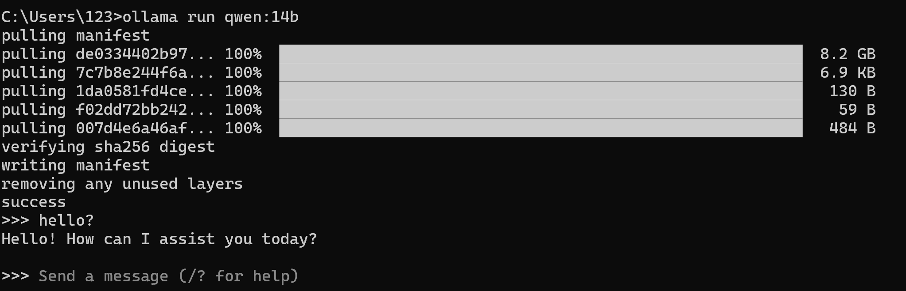

# 通义千问Qwen：14b

Qwen-14B（通义千问-14B）是阿里云研发的通义千问大模型系列中具有 140 亿参数的模型。作为一款基于 Transformer 架构的大型语言模型， Qwen-14B 在广泛且多样化的预训练数据上进行了训练，这些数据包括大量网络文本、专业书籍和代码等。

## 本地部署

#### 一、Ollama部署

通过ollama进行本地部署，通过Win+R输入cmd进入命令控制行，输入：

```
ollama run Qwen:14b
```



安装完成后即可与Qwen进行对话。

#### 二、模型调用

在Anaconda Prompt或Pycharm terminal中安装ollama包。

```
pip install ollama
```

使用OpenAI的接口包对Qwen进行调用包，model_name_为所调用的模型的名称。

```
import ollama

model = ollama.Model("model_name")
model.run()

while True:
    user_input = input("You:")
    if user_input.lower() == "quit":
        break
    
    respone = model.predict(user_input)
    print(f"Chatbot:{respone}")
```

